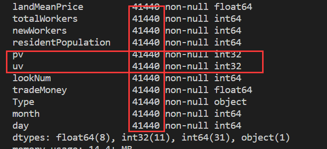
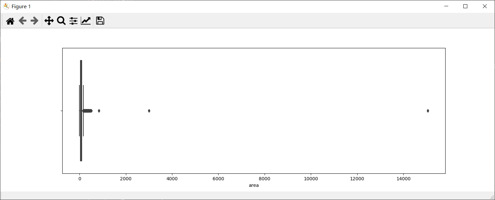
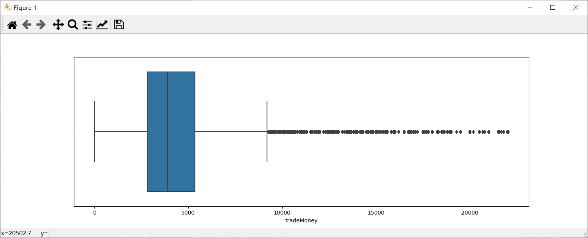
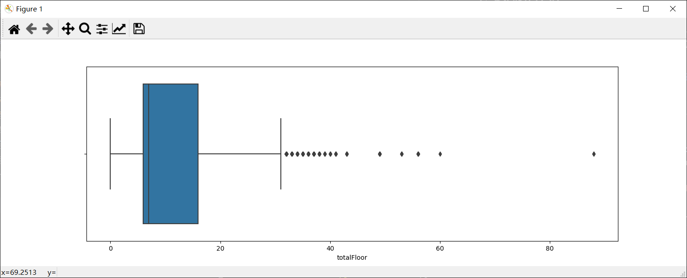
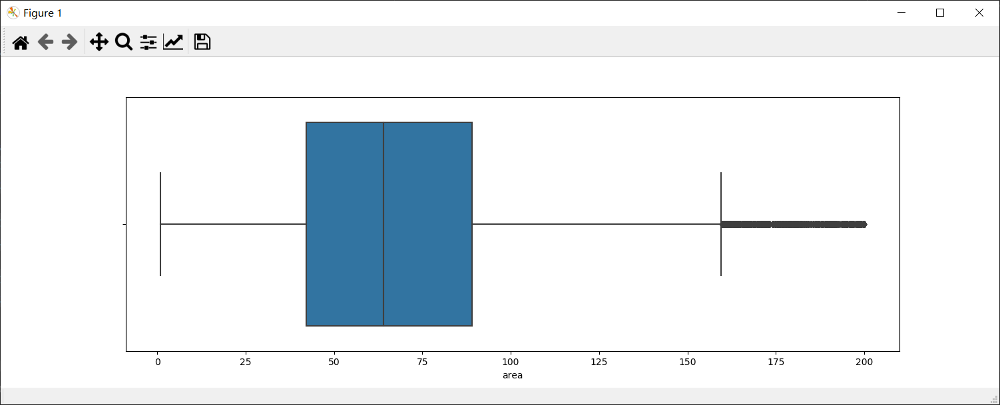
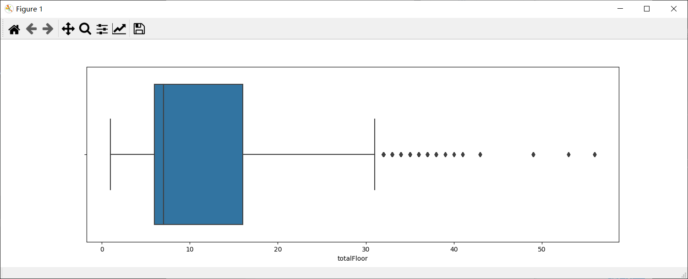
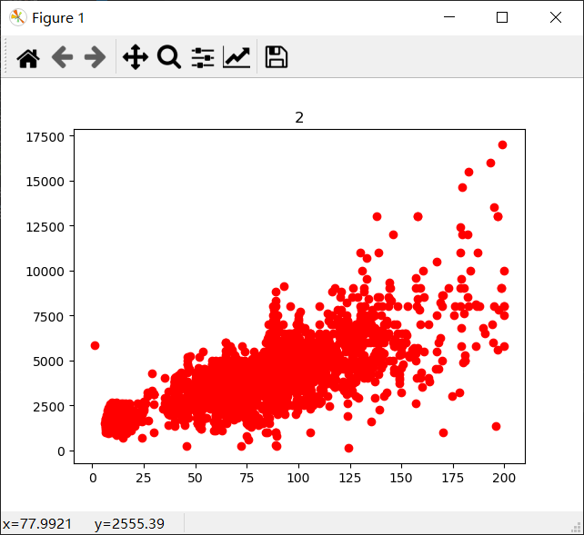
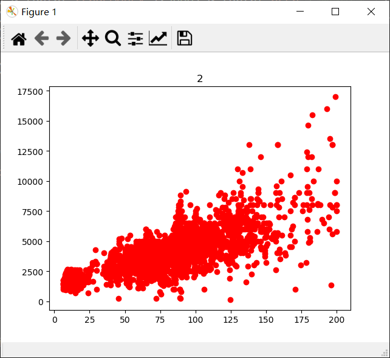

# 数据清洗

## 缺失值分析及处理

1. 缺失值处理
    * 缺失值的处理手段大体可以分为：删除、填充、映射到高维(当做类别处理)。
    * 从之前的任务中可知，pu、pv是存在缺失值的，rentType中存在'--'的情况，buildYear存在"暂无信息"的情况，这些都算是缺失值。
    * 在rentType中的"未知方式"，houseToward的"暂无数据"都算是缺失值，但是对于这些缺失方式，我们可以把它当做是特殊的一类处理，而不需要去主动修改或填充值。
    * 具体处理方式
        - 将rentType的"--"转化为"未知方式"类别
        ``` python
            data['rentType'][data['rentType'] == '--'] = '未知方式'
            data['rentType'][data['rentType'] == '--'] = '未知方式' //为何这样不可
        ```
        - 将pv/pu的缺失值用均值填充
        ``` python
            data['pv'].fillna(data['pv'].mean(),inplace = True)
            data['uv'].fillna(data['uv'].mean(),inplace = True)
            data['pv'] = data['pv'].astype('int')
            data['uv'] = data['uv'].astype('int')
        ```
        - buildYear存在"暂无信息"，将其用众数填充
        ``` python
            buildYearmost = pd.DataFrame(data[data['buildYear'] != '暂无信息']['buildYear'].mode())
            data['buildYear'][data['buildYear'] == '暂无信息'] = buildYearmost.iloc[0, 0]
            # data.loc[data[data['buildYear'] == '暂无信息'].index, 'buildYear'] = buildYearmost.iloc[0, 0]
            data['buildYear'] = data['buildYear'].astype('int')
        ```
2. 基础的数据处理
    * 转换object类型数据
        - 采用LabelEncoder的方式编码. eg: 将[中国，美国，日本]转化为[0,1,2]
        - 疑问？？？ 为何这里采用LabelEncoder而非One-hot
        ``` python
            columns = ['rentType','communityName','houseType', 'houseFloor', 'houseToward', 'houseDecoration',  'region', 'plate']
            
            for feature in columns:
                data[feature] = LabelEncoder().fit_transform(data[feature])
        ```
    * 时间字段的处理
        - buildYear由于之前存在"暂无信息"，即需要在用众数填充之后转成int型，便于之后的分析
        - tradeTime将其分割为月和日
        ``` python
             data['month'] = data['tradeTime'].apply(lambda x: month(x))
             data['day'] = data['tradeTime'].apply(lambda x: day(x))
        ```
    * 删除无关字段
        * ID是唯一码，建模无用，所以直接删除；
        * city只有一个SH值，也直接删除；
        * tradeTime已经分割成月和日，删除原来字段
        ``` python
             data.drop('city', axis=1, inplace=True)
             data.drop('tradeTime', axis=1, inplace=True)
             data.drop('ID', axis=1, inplace=True)
        ```
* 完整代码如下：
``` python
    def month(x):
        month = int(x.split('/')[1])
        return month

    def day(x):
        day = int(x.split('/')[2])
        return day

    def preprocessingData(data):
        data['rentType'][data['rentType'] == '--'] = '未知方式'

        buildYearmost = pd.DataFrame(data[data['buildYear'] != '暂无信息']['buildYear'].mode())
        data['buildYear'][data['buildYear'] == '暂无信息'] = buildYearmost.iloc[0, 0]
        # data.loc[data[data['buildYear'] == '暂无信息'].index, 'buildYear'] = buildYearmost.iloc[0, 0]
        data['buildYear'] = data['buildYear'].astype('int')

        data['pv'].fillna(data['pv'].mean(),inplace = True)
        data['uv'].fillna(data['uv'].mean(),inplace = True)
        data['pv'] = data['pv'].astype('int')
        data['uv'] = data['uv'].astype('int')

        # 转换object类型数据
        columns = ['rentType','communityName','houseType', 'houseFloor', 'houseToward', 'houseDecoration',  'region', 'plate']
        
        for feature in columns:
            data[feature] = LabelEncoder().fit_transform(data[feature])

        data['month'] = data['tradeTime'].apply(lambda x: month(x))
        data['day'] = data['tradeTime'].apply(lambda x: day(x))

        data.drop('city', axis=1, inplace=True)
        data.drop('tradeTime', axis=1, inplace=True)
        data.drop('ID', axis=1, inplace=True)
        
        return data
```

*  效果截图如下：
    

3. 异常值分析及处理
    * 主要针对area和tradeMoney两个维度处理。
        - 针对tradeMoney，这里采用的是IsolationForest模型自动处理。[iForest异常检测](https://zhuanlan.zhihu.com/p/25040651)
        ``` python
            def IF_drop(train):
                IForest = IsolationForest(contamination=0.01)
                IForest.fit(train["tradeMoney"].values.reshape(-1,1))
                y_pred = IForest.predict(train["tradeMoney"].values.reshape(-1,1))
                drop_index = train.loc[y_pred==-1].index
                train.drop(drop_index,inplace=True)
                return train
        ```
        - 针对area与totalFloor是主观+数据可视化的方式得到的结果
            * 对这些字段的沙箱图效果如下：
                
                
                
                * 可知对于area字段，有部分异常值，整体范围应该在200以内
                * 对于tradeMoney字段，经过iForest异常检测之后，变得比较正常
                * 对于totalFloor字段，中位数太偏左，有部分很小的异常值，也有很大的异常值进行影响。
        ``` python
            def dropData(train):
                train = train[train.area <= 200]
                train = train[(train.totalFloor <=60)&(train.totalFloor != 0)]
                # train.drop(train[(train['totalFloor'] == 0)].index, inplace=True)
                return train
        ```
        ``` python 
            plt.figure(figsize=(15,5))
            sns.boxplot(data_train.area)
            plt.show()
            plt.figure(figsize=(15,5))
            sns.boxplot(data_train.tradeMoney)
            plt.show()
            plt.figure(figsize=(15,5))
            sns.boxplot(data_train.totalFloor)
            plt.show()
        ```
        经过变换后，效果如下
            
            

4. 深度清洗
    * 对每一个region的数据，对area和tradeMoney两个维度进行深度清洗
    * 在这边我使用了点图，目的是为了更好的看清对同一region而言，area和tradeMoney之间的关系
    ``` python
        for i in pd.DataFrame(data_train['region'].value_counts()).reset_index()['index']:
        plt.plot(data_train[data_train['region'] == i]['area'].values,data_train[data_train['region']== i]['tradeMoney'].values,'ro')
        plt.title(i)
        plt.show()
    ```
    其中部分图的效果如下

    
    对其中分布很离散的点进行数据清除后，效果如下

    
    
    清除数据的代码如下所示
    ``` python
    def cleanData(data):
        data.drop(data[(data['region'] == 4)&(data['tradeMoney']>12000)&(data['area']<60)].index,inplace=True)
        data.drop(data[(data['region'] == 4) & (data['tradeMoney']<3000) & (data['area']>175)].index,inplace=True)
        data.drop(data[(data['region'] == 2) & (data['tradeMoney']>5000) & (data['area']<25)].index,inplace=True)
        data.drop(data[(data['region'] == 9) & (data['tradeMoney']>14000) & (data['area']<100)].index,inplace=True)
        data.drop(data[(data['region'] == 11 ) & (data['tradeMoney']<5000) & (data['area']>125)].index,inplace=True)
        data.drop(data[(data['region'] == 5 ) & (data['tradeMoney']>5000) & (data['area']<100)].index,inplace=True)
        data.drop(data[(data['region'] == 6 ) & (data['tradeMoney']<5000) & (data['area']>125)].index,inplace=True)
        data.drop(data[(data['region'] == 7 ) & (data['tradeMoney']<5000) & (data['area']>125)].index,inplace=True)
        data.drop(data[(data['region'] == 0 ) & (data['tradeMoney']<5000) & (data['area']>100)].index,inplace=True)
        data.drop(data[(data['region'] == 12 ) & (data['tradeMoney']<3000) & (data['area']>75)].index,inplace=True)
        data.drop(data[(data['region'] == 8 ) & (data['tradeMoney']<3000) & (data['area']>100)].index,inplace=True)
    return data
    ```