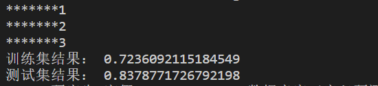

# 特征工程

## 一些统计特征的函数
``` python
    #计算均值
    gp = train.groupby(by)[fea].mean()
    #计算中位数
    gp = train.groupby(by)[fea].median()
    #计算方差
    gp = train.groupby(by)[fea].std()
    #计算最大值
    gp = train.groupby(by)[fea].max()
    #计算最小值
    gp = train.groupby(by)[fea].min()
    #计算出现次数
    gp = train.groupby(by)[fea].size()
```

## 代码如下
``` python
import pandas as pd
import warnings
warnings.filterwarnings('ignore')
from sklearn.preprocessing import LabelEncoder
from sklearn.ensemble import IsolationForest

path = "./data/"
train = pd.read_csv(path+'train_data.csv',encoding='utf-8')
test = pd.read_csv(path+'test_a.csv',encoding='utf-8')
target_test = pd.read_csv(path+'评分文件/sub_a_913.csv')
def month(x):
    month = int(x.split('/')[1])
    return month

def day(x):
    day = int(x.split('/')[2])
    return day

def preprocessingData(data):
    data['rentType'][data['rentType'] == '--'] = '未知方式'

    buildYearmost = pd.DataFrame(data[data['buildYear'] != '暂无信息']['buildYear'].mode())
    data['buildYear'][data['buildYear'] == '暂无信息'] = buildYearmost.iloc[0, 0]
    # data.loc[data[data['buildYear'] == '暂无信息'].index, 'buildYear'] = buildYearmost.iloc[0, 0]
    data['buildYear'] = data['buildYear'].astype('int')

    data['pv'].fillna(data['pv'].mean(),inplace = True)
    data['uv'].fillna(data['uv'].mean(),inplace = True)
    data['pv'] = data['pv'].astype('int')
    data['uv'] = data['uv'].astype('int')

    # 转换object类型数据

    # data['month'] = data['tradeTime'].apply(lambda x: month(x))
    # data['day'] = data['tradeTime'].apply(lambda x: day(x))

    data.drop('city', axis=1, inplace=True)
    # data.drop('tradeTime', axis=1, inplace=True)
    data.drop('ID', axis=1, inplace=True)
    
    return data
    
def IF_drop(train):
    IForest = IsolationForest(contamination=0.01)
    IForest.fit(train["tradeMoney"].values.reshape(-1,1))
    y_pred = IForest.predict(train["tradeMoney"].values.reshape(-1,1))
    drop_index = train.loc[y_pred==-1].index
    train.drop(drop_index,inplace=True)
    return train


def dropData(train):
    # 丢弃部分异常值
    train = train[train.area <= 200]
    train = train[(train.totalFloor <=60)&(train.totalFloor != 0)]
    # train.drop(train[(train['totalFloor'] == 0)].index, inplace=True)
    return train

# for feature in ['region']:
#     print(feature + "的特征分布如下：")
#     print(data_train[feature].value_counts())
# plt.figure(figsize=(15,5))
# sns.boxplot(data_train.area)
# plt.show()
# plt.figure(figsize=(15,5))
# sns.boxplot(data_train.tradeMoney)
# plt.show()
# plt.figure(figsize=(15,5))
# sns.boxplot(data_train.totalFloor)
# plt.show()

def cleanData(data):
    data.drop(data[(data['region'] == 4)&(data['tradeMoney']>12000)&(data['area']<60)].index,inplace=True)
    data.drop(data[(data['region'] == 4) & (data['tradeMoney']<3000) & (data['area']>175)].index,inplace=True)
    data.drop(data[(data['region'] == 2) & (data['tradeMoney']>5000) & (data['area']<25)].index,inplace=True)
    data.drop(data[(data['region'] == 9) & (data['tradeMoney']>14000) & (data['area']<100)].index,inplace=True)
    data.drop(data[(data['region'] == 11 ) & (data['tradeMoney']<5000) & (data['area']>125)].index,inplace=True)
    data.drop(data[(data['region'] == 5 ) & (data['tradeMoney']>5000) & (data['area']<100)].index,inplace=True)
    data.drop(data[(data['region'] == 6 ) & (data['tradeMoney']<5000) & (data['area']>125)].index,inplace=True)
    data.drop(data[(data['region'] == 7 ) & (data['tradeMoney']<5000) & (data['area']>125)].index,inplace=True)
    data.drop(data[(data['region'] == 0 ) & (data['tradeMoney']<5000) & (data['area']>100)].index,inplace=True)
    data.drop(data[(data['region'] == 12 ) & (data['tradeMoney']<3000) & (data['area']>75)].index,inplace=True)
    data.drop(data[(data['region'] == 8 ) & (data['tradeMoney']<3000) & (data['area']>100)].index,inplace=True)
    return data

train = preprocessingData(train)
test = preprocessingData(test)
train = IF_drop(train)
train = dropData(train)
train = cleanData(train)

target_train = train.pop('tradeMoney')

def newfeature(data):


    # 将houseType转为'Room'，'Hall'，'Bath'
    def Room(x):
        Room = int(x.split('室')[0])
        return Room
    def Hall(x):
        Hall = int(x.split("室")[1].split("厅")[0])
        return Hall
    def Bath(x):
        Bath = int(x.split("室")[1].split("厅")[1].split("卫")[0])
        return Bath

    data['Room'] = data['houseType'].apply(lambda x: Room(x))
    data['Hall'] = data['houseType'].apply(lambda x: Hall(x))
    data['Bath'] = data['houseType'].apply(lambda x: Bath(x))
    data['Room_Bath'] = (data['Bath']+1) / (data['Room']+1)
    # 填充租房类型
    data.loc[(data['rentType'] == '未知方式') & (data['Room'] <= 1), 'rentType'] = '整租'
    data.loc[(data['rentType'] == '未知方式') & (data['Room_Bath'] > 1), 'rentType'] = '合租'
    data.loc[(data['rentType'] == '未知方式') & (data['Room'] > 1) & (data['area'] < 50), 'rentType'] = '合租'
    data.loc[(data['rentType'] == '未知方式') & (data['area'] / data['Room'] < 20), 'rentType'] = '合租'
    data.loc[(data['rentType'] == '未知方式') & (data['area'] <= 50) & (data['Room'] == 2), 'rentType'] = '合租'
    data.loc[(data['rentType'] == '未知方式') & (data['area'] > 60) & (data['Room'] == 2), 'rentType'] = '整租'
    data.loc[(data['rentType'] == '未知方式') & (data['area'] <= 60) & (data['Room'] == 3), 'rentType'] = '合租'
    data.loc[(data['rentType'] == '未知方式') & (data['area'] > 60) & (data['Room'] == 3), 'rentType'] = '整租'
    data.loc[(data['rentType'] == '未知方式') & (data['area'] >= 100) & (data['Room'] > 3), 'rentType'] = '整租'

    # data.drop('Room_Bath', axis=1, inplace=True)
    # 提升0.0001
    def month(x):
        month = int(x.split('/')[1])
        return month
    # def day(x):
    #     day = int(x.split('/')[2])
    #     return day
    # 结果变差

    # 分割交易时间
    # data['year']=data['tradeTime'].apply(lambda x:year(x))
    data['month'] = data['tradeTime'].apply(lambda x: month(x))
    # data['day'] = data['tradeTime'].apply(lambda x: day(x))# 结果变差
    #     data['pv/uv'] = data['pv'] / data['uv']
    #     data['房间总数'] = data['室'] + data['厅'] + data['卫']

    # 合并部分配套设施特征
    data['trainsportNum'] = 5 * data['subwayStationNum'] / data['subwayStationNum'].mean() + data['busStationNum'] / \
                                                                                             data[
                                                                                                 'busStationNum'].mean()
    data['all_SchoolNum'] = 2 * data['interSchoolNum'] / data['interSchoolNum'].mean() + data['schoolNum'] / data[
        'schoolNum'].mean() \
                            + data['privateSchoolNum'] / data['privateSchoolNum'].mean()
    data['all_hospitalNum'] = 2 * data['hospitalNum'] / data['hospitalNum'].mean() + \
                              data['drugStoreNum'] / data['drugStoreNum'].mean()
    data['all_mall'] = data['mallNum'] / data['mallNum'].mean() + \
                       data['superMarketNum'] / data['superMarketNum'].mean()
    data['otherNum'] = data['gymNum'] / data['gymNum'].mean() + data['bankNum'] / data['bankNum'].mean() + \
                       data['shopNum'] / data['shopNum'].mean() + 2 * data['parkNum'] / data['parkNum'].mean()

    data.drop(['subwayStationNum', 'busStationNum',
               'interSchoolNum', 'schoolNum', 'privateSchoolNum',
               'hospitalNum', 'drugStoreNum', 'mallNum', 'superMarketNum', 'gymNum', 'bankNum', 'shopNum', 'parkNum'],
              axis=1, inplace=True)
    # 提升0.0005
    
#     data['houseType_1sumcsu']=data['Bath'].map(lambda x:str(x))+data['month'].map(lambda x:str(x))
#     data['houseType_2sumcsu']=data['Bath'].map(lambda x:str(x))+data['communityName']
#     data['houseType_3sumcsu']=data['Bath'].map(lambda x:str(x))+data['plate']
    
    data.drop('houseType', axis=1, inplace=True)
    data.drop('tradeTime', axis=1, inplace=True)
    
    data["area"] = data["area"].astype(int)


    # categorical_feats = ['rentType', 'houseFloor', 'houseToward', 'houseDecoration', 'communityName','region', 'plate']
    categorical_feats = ['rentType', 'houseFloor', 'houseToward', 'houseDecoration',  'region', 'plate','cluster']

    return data, categorical_feats


#计算统计特征
def featureCount(train,test):
    train['data_type'] = 0
    test['data_type'] = 1
    data = pd.concat([train, test], axis=0, join='outer')
    data,categorical_feats = newfeature(data)
    def feature_count(data, features=[]):
        new_feature = 'count'
        for i in features:
            new_feature += '_' + i
        temp = data.groupby(features).size().reset_index().rename(columns={0: new_feature})
        data = data.merge(temp, 'left', on=features)
        return data

    data = feature_count(data, ['communityName'])
    data = feature_count(data, ['buildYear'])
    data = feature_count(data, ['totalFloor'])
    data = feature_count(data, ['communityName', 'totalFloor'])
    data = feature_count(data, ['communityName', 'newWorkers'])
    data = feature_count(data, ['communityName', 'totalTradeMoney'])
    new_train = data[data['data_type'] == 0]
    new_test = data[data['data_type'] == 1]
    new_train.drop('data_type', axis=1, inplace=True)
    new_test.drop(['data_type'], axis=1, inplace=True)
    return new_train, new_test
    
#groupby生成统计特征：mean,std等

def gourpby(train,test):
    train['data_type'] = 0
    test['data_type'] = 1
    data = pd.concat([train, test], axis=0, join='outer')
    columns = ['rentType', 'houseFloor', 'houseToward', 'houseDecoration', 'communityName', 'region', 'plate']
    for feature in columns:
        data[feature] = LabelEncoder().fit_transform(data[feature])

    temp = data.groupby('communityName')['area'].agg({'com_area_mean': 'mean', 'com_area_std': 'std'})
    temp.fillna(0, inplace=True)
    data = data.merge(temp, on='communityName', how='left')
    
    data['price_per_area'] = data.tradeMeanPrice / data.area * 100
    temp = data.groupby('communityName')['price_per_area'].agg(
        {'comm_price_mean': 'mean', 'comm_price_std': 'std'})
    temp.fillna(0, inplace=True)
    data = data.merge(temp, on='communityName', how='left')
   
    temp = data.groupby('plate')['price_per_area'].agg(
        {'plate_price_mean': 'mean', 'plate_price_std': 'std'})
    temp.fillna(0, inplace=True)
    data = data.merge(temp, on='plate', how='left')
    data.drop('price_per_area', axis=1, inplace=True)

    temp = data.groupby('plate')['area'].agg({'plate_area_mean': 'mean', 'plate_area_std': 'std'})
    temp.fillna(0, inplace=True)
    data = data.merge(temp, on='plate', how='left')
    
    # temp = data.groupby('plate')['buildYear'].agg({'plate_year_mean': 'mean', 'plate_year_std': 'std'})
    # data = data.merge(temp, on='plate', how='left')
    # data.plate_year_mean = data.plate_year_mean.astype('int')
    # data['comm_plate_year_diff'] = data.buildYear - data.plate_year_mean
    # data.drop('plate_year_mean', axis=1, inplace=True)

    temp = data.groupby('plate')['trainsportNum'].agg('sum').reset_index(name='plate_trainsportNum')
    data = data.merge(temp, on='plate', how='left')
    temp = data.groupby(['communityName', 'plate'])['trainsportNum'].agg('sum').reset_index(name='com_trainsportNum')
    data = data.merge(temp, on=['communityName', 'plate'], how='left')
    data['trainsportNum_ratio'] = list(map(lambda x, y: round(x / y, 3) if y != 0 else -1,
                                           data['com_trainsportNum'], data['plate_trainsportNum']))
    data = data.drop(['com_trainsportNum', 'plate_trainsportNum'], axis=1)

    temp = data.groupby('plate')['all_SchoolNum'].agg('sum').reset_index(name='plate_all_SchoolNum')
    data = data.merge(temp, on='plate', how='left')
    temp = data.groupby(['communityName', 'plate'])['all_SchoolNum'].agg('sum').reset_index(name='com_all_SchoolNum')
    data = data.merge(temp, on=['communityName', 'plate'], how='left')
    data = data.drop(['com_all_SchoolNum', 'plate_all_SchoolNum'], axis=1)

    temp = data.groupby(['communityName', 'plate'])['all_mall'].agg('sum').reset_index(name='com_all_mall')
    data = data.merge(temp, on=['communityName', 'plate'], how='left')

    temp = data.groupby('plate')['otherNum'].agg('sum').reset_index(name='plate_otherNum')
    data = data.merge(temp, on='plate', how='left')
    temp = data.groupby(['communityName', 'plate'])['otherNum'].agg('sum').reset_index(name='com_otherNum')
    data = data.merge(temp, on=['communityName', 'plate'], how='left')
    data['other_ratio'] = list(map(lambda x, y: round(x / y, 3) if y != 0 else -1,
                                   data['com_otherNum'], data['plate_otherNum']))
    data = data.drop(['com_otherNum', 'plate_otherNum'], axis=1)

    temp = data.groupby(['month', 'communityName']).size().reset_index(name='communityName_saleNum')
    data = data.merge(temp, on=['month', 'communityName'], how='left')
    temp = data.groupby(['month', 'plate']).size().reset_index(name='plate_saleNum')
    data = data.merge(temp, on=['month', 'plate'], how='left')

    data['sale_ratio'] = round((data.communityName_saleNum + 1) / (data.plate_saleNum + 1), 3)
    data['sale_newworker_differ'] = 3 * data.plate_saleNum - data.newWorkers
    data.drop(['communityName_saleNum', 'plate_saleNum'], axis=1, inplace=True)

    new_train = data[data['data_type'] == 0]
    new_test = data[data['data_type'] == 1]
    new_train.drop('data_type', axis=1, inplace=True)
    new_test.drop(['data_type'], axis=1, inplace=True)
    return new_train, new_test


#聚类
def cluster(train,test):
    from sklearn.mixture import GaussianMixture

    train['data_type'] = 0
    test['data_type'] = 1
    data = pd.concat([train, test], axis=0, join='outer')
    col = ['totalFloor',
           'houseDecoration', 'communityName', 'region', 'plate', 'buildYear',

           'tradeMeanPrice', 'tradeSecNum', 'totalNewTradeMoney',
           'totalNewTradeArea', 'tradeNewMeanPrice', 'tradeNewNum', 'remainNewNum',

           'landTotalPrice', 'landMeanPrice', 'totalWorkers',
           'newWorkers', 'residentPopulation', 'lookNum',
           'trainsportNum',
           'all_SchoolNum', 'all_hospitalNum', 'all_mall', 'otherNum']
    # EM
    gmm = GaussianMixture(n_components=3, covariance_type='full', random_state=0)
    data['cluster']= pd.DataFrame(gmm.fit_predict(data[col]))


    col1 = ['totalFloor','houseDecoration', 'communityName', 'region', 'plate', 'buildYear']
    col2 = ['tradeMeanPrice', 'tradeSecNum', 'totalNewTradeMoney',
            'totalNewTradeArea', 'tradeNewMeanPrice', 'tradeNewNum', 'remainNewNum',
            'landTotalPrice', 'landMeanPrice', 'totalWorkers',
            'newWorkers', 'residentPopulation', 'lookNum',
            'trainsportNum',
            'all_SchoolNum', 'all_hospitalNum', 'all_mall', 'otherNum']
    for feature1 in col1:
        for feature2 in col2:
        
            temp = data.groupby(['cluster',feature1])[feature2].agg('mean').reset_index(name=feature2+'_'+feature1+'_cluster_mean')
            temp.fillna(0, inplace=True)
       
            data = data.merge(temp, on=['cluster', feature1], how='left')
    
   
    new_train = data[data['data_type'] == 0]
    new_test = data[data['data_type'] == 1]
    new_train.drop('data_type', axis=1, inplace=True)
    new_test.drop(['data_type'], axis=1, inplace=True)
    
    return new_train, new_test

train, test = featureCount(train, test)
print("*******1")
train, test = gourpby(train, test)
print("*******2")
train, test = cluster(train, test)   
print("*******3")
#对比特征工程前后线性模型结果情况
test=test.fillna(0)
# Lasso回归
from sklearn.linear_model import Lasso
lasso=Lasso(alpha=0.1)
lasso.fit(train,target_train)
#预测测试集和训练集结果
y_pred_train=lasso.predict(train)
y_pred_test=lasso.predict(test)

#对比结果
from sklearn.metrics import r2_score
score_train=r2_score(y_pred_train,target_train)
print("训练集结果：",score_train)
score_test=r2_score(y_pred_test, target_test)
print("测试集结果：",score_test)
```
## 结果如下
